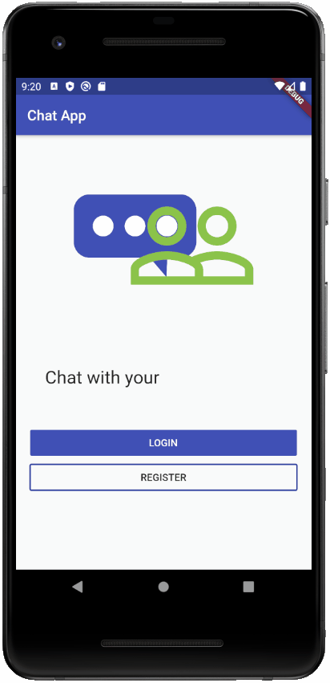
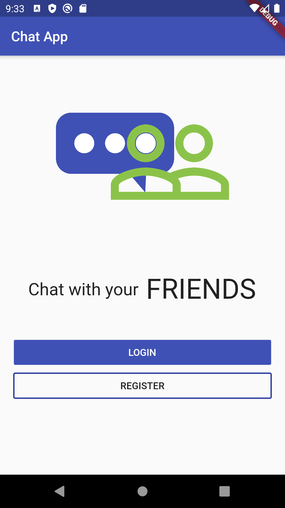
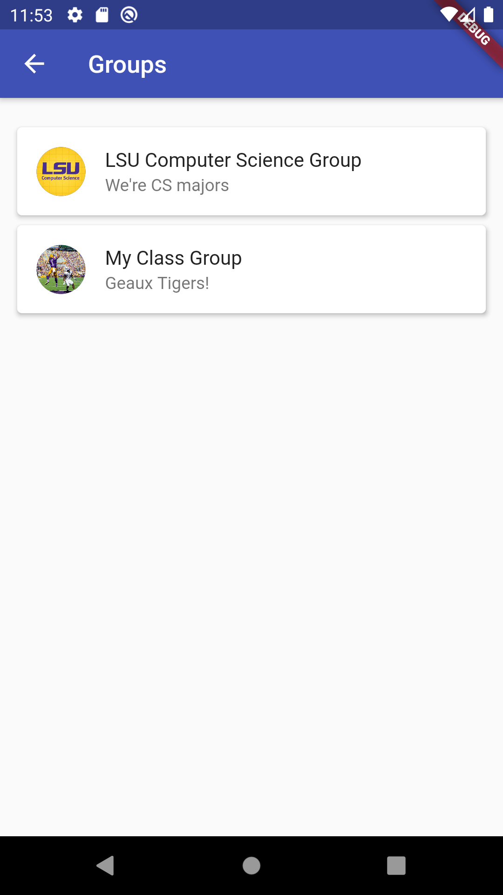
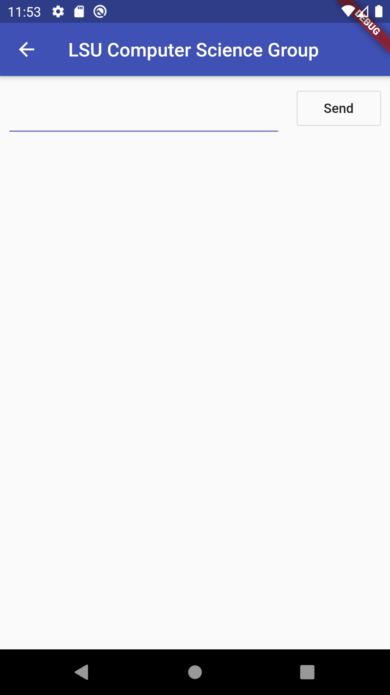
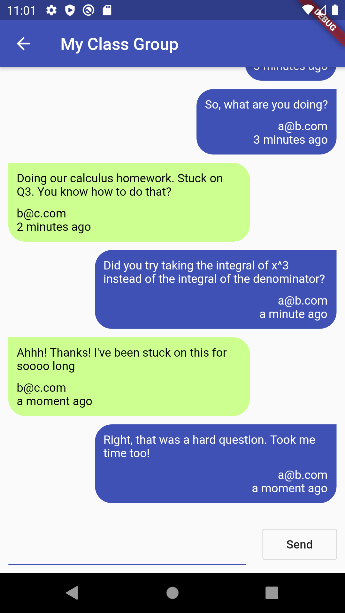
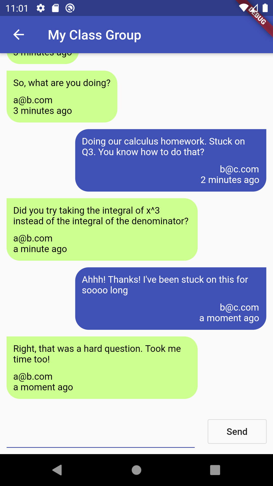

# Chat App

Chat with your friends, family, and anyone else you want to chat with!

<a href="https://youtu.be/-T7bIMsbCSg" target="_blank">Live Coding Video on YouTube (Part 1)</a>
 
<a href="https://youtu.be/S3pFTps6O2Q" target="_blank">Live Coding Video on YouTube (Part 2)</a>
 
<a href="https://youtu.be/1QbNDGZq_80" target="_blank">Live Coding Video on YouTube (Part 3)</a>

## Skills Used

* Firebase's Cloud Firestore
  * Add, update, and delete documents
  * Complex collection and document management
* Hero animations
* Animated text library
* Flexible and Expanded widgets
* Themes

## Screenshots (gifs)

### Part 1: HomeScreen and AuthScreen (only register)

### Part 2: GroupScreen and part of the ChatScreen

### Part 3: ChatScreen

## Screenshots (png)

### Part 1: HomeScreen and AuthScreen (only register)

### Part 2: GroupScreen and part of the ChatScreen

### Part 3: ChatScreen

